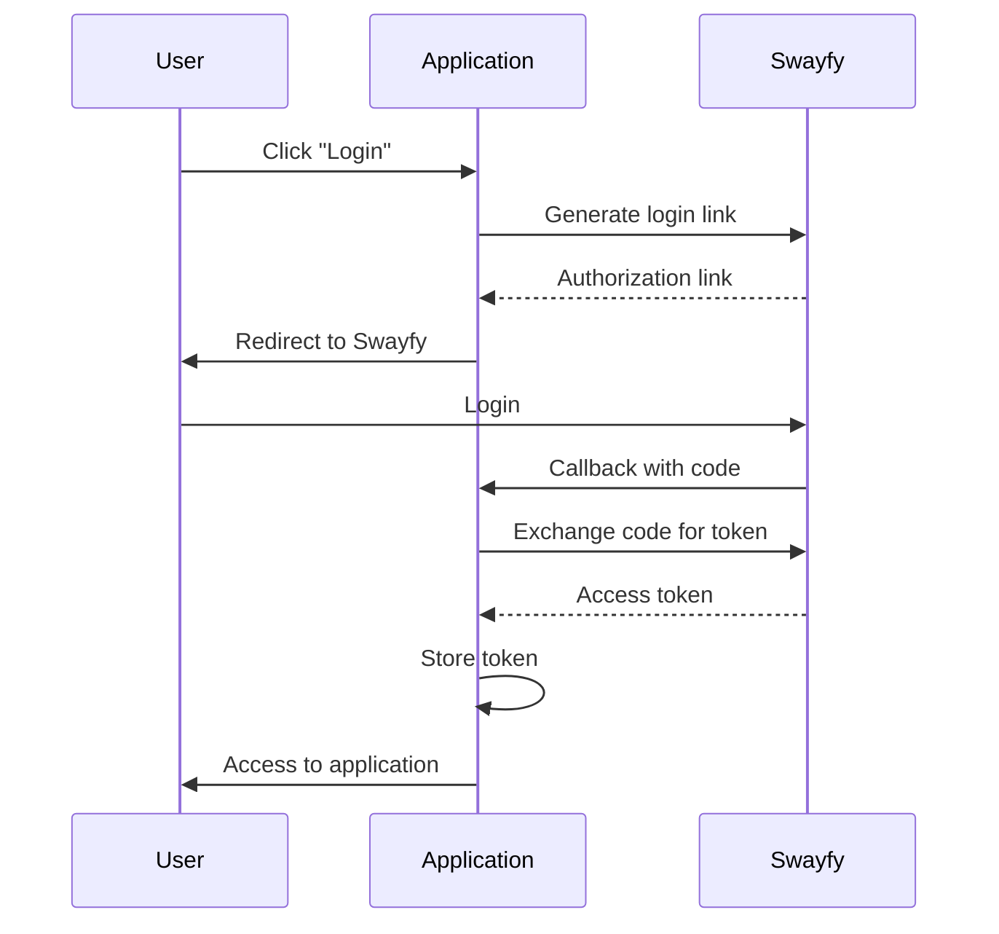

# Swayfy Authorization Guide

Complete developer guide for implementing authorization using the Swayfy platform.

## Table of Contents

1. [Introduction](#introduction)
2. [How Swayfy Authorization Works](#how-swayfy-authorization-works)
3. [Step-by-Step Implementation](#step-by-step-implementation)
4. [Code Examples](#code-examples)
5. [Configuration](#configuration)
6. [Security](#security)
7. [Troubleshooting](#troubleshooting)

## Introduction

Swayfy is an authorization platform that enables secure user login without the need to implement your own authentication system. The system works on an OAuth-like flow with access tokens.

## How Swayfy Authorization Works

### Authorization Flow:

1. **Generate Login Link** - Application generates a link to Swayfy
2. **User Redirect** - User is redirected to Swayfy
3. **Login** - User logs in on the Swayfy platform
4. **Callback** - Swayfy redirects back with authorization code
5. **Token Exchange** - Application exchanges code for access token
6. **Verification** - Token is verified with each request



## Step-by-Step Implementation

### Step 1: Configuration

Create a configuration file:

```javascript
// config/auth.js
module.exports = {
  swayfy: {
    apiUrl: 'https://swayfy.xyz',
    redirectUrl: 'https://example.com/auth/callback',
    confirmationToken: 'unique_app_identifier'
  },
  allowedUsers: [
    'username1',
    'username2'
  ]
};
```

### Step 2: Generate Login Link

```javascript
async function generateLoginLink() {
  const response = await fetch('https://swayfy.xyz/api/auth/generate', {
    method: 'POST',
    headers: {
      'Content-Type': 'application/json'
    },
    body: JSON.stringify({
      type: 'login',
      redirectUrl: config.swayfy.redirectUrl,
      confirmationToken: config.swayfy.confirmationToken
    })
  });

  const data = await response.json();
  return data.url;
}
```

### Step 3: Handle Callback

```javascript
app.get('/auth/callback', async (req, res) => {
  const { code, id, confirm } = req.query;
  
  if (confirm === config.swayfy.confirmationToken) {
    try {
      const token = await exchangeCodeForToken(code, id);
      // Store token in session or localStorage
      res.redirect('/dashboard');
    } catch (error) {
      res.redirect('/login?error=auth_failed');
    }
  }
});
```

### Step 4: Exchange Code for Token

```javascript
async function exchangeCodeForToken(code, accountId) {
  const response = await fetch('https://swayfy.xyz/api/exchangeToken', {
    method: 'POST',
    headers: {
      'Content-Type': 'application/json'
    },
    body: JSON.stringify({
      code: code,
      accountId: accountId
    })
  });

  const data = await response.json();
  
  if (data.success) {
    return {
      token: data.token,
      user: data.user
    };
  }
  
  throw new Error('Token exchange failed');
}
```

### Step 5: Token Verification

```javascript
async function verifyToken(token, accountId) {
  const response = await fetch('https://swayfy.xyz/api/verifyToken', {
    method: 'POST',
    headers: {
      'Content-Type': 'application/json'
    },
    body: JSON.stringify({
      token: token,
      accountId: accountId
    })
  });

  const data = await response.json();
  return data.success && data.valid;
}
```

## Code Examples

See files in this folder:
- `frontend-example.js` - Client-side implementation
- `backend-example.js` - Server-side implementation
- `middleware-example.js` - Authorization middleware
- `react-example.jsx` - React example

## Configuration

### Environment Variables

```env
SWAYFY_API_URL=https://swayfy.xyz
SWAYFY_REDIRECT_URL=https://example.com/auth/callback
SWAYFY_CONFIRMATION_TOKEN=unique_app_identifier
```

### Allowed Users

List of users who can log into the application:

```javascript
const allowedUsers = [
  'admin_username',
  'user_username'
];
```

## Security

### Best Practices:

1. **Always verify tokens** with each request to protected resources
2. **Use HTTPS** for all communications
3. **Store tokens securely** (httpOnly cookies, localStorage with caution)
4. **Implement token timeout** for security
5. **Log access attempts** for security auditing

### Example Security Middleware:

```javascript
const requireAuth = async (req, res, next) => {
  const token = req.headers.authorization?.replace('Bearer ', '');
  const accountId = req.headers['x-account-id'];
  
  if (!token || !accountId) {
    return res.status(401).json({ error: 'Unauthorized' });
  }
  
  try {
    const isValid = await verifyToken(token, accountId);
    if (isValid) {
      next();
    } else {
      res.status(401).json({ error: 'Invalid token' });
    }
  } catch (error) {
    res.status(500).json({ error: 'Auth verification failed' });
  }
};
```

## Troubleshooting

### Common Issues:

#### 1. "Token exchange failed"
- Check if `code` and `accountId` are correct
- Ensure the code hasn't expired (valid for 10 minutes)

#### 2. "Invalid token"
- Token may have expired
- Check if `accountId` matches the token

#### 3. "Unauthorized user"
- User is not in the `allowedUsers` list
- Check permission configuration

#### 4. CORS Issues
```javascript
app.use(cors({
  origin: 'https://swayfy.xyz',
  credentials: true
}));
```

### Debugging:

```javascript
// Enable detailed logging
const DEBUG = process.env.NODE_ENV === 'development';

if (DEBUG) {
  console.log('Auth request:', { code, accountId, token });
}
```

## API Reference

### Swayfy Endpoints:

#### POST `/api/auth/generate`
Generates authorization link.

**Request:**
```json
{
  "type": "login",
  "redirectUrl": "https://example.com/callback",
  "confirmationToken": "unique_identifier"
}
```

**Response:**
```json
{
  "success": true,
  "url": "https://swayfy.xyz/auth/login?..."
}
```

#### POST `/api/exchangeToken`
Exchanges authorization code for access token.

**Request:**
```json
{
  "code": "auth_code",
  "accountId": "user_account_id"
}
```

**Response:**
```json
{
  "success": true,
  "token": "access_token",
  "user": {
    "username": "user",
    "accountId": "account_id"
  }
}
```

#### POST `/api/verifyToken`
Verifies token validity.

**Request:**
```json
{
  "token": "access_token",
  "accountId": "user_account_id"
}
```

**Response:**
```json
{
  "success": true,
  "valid": true
}
```

## Support

For issues:
1. Check Swayfy API documentation
2. Review application logs
3. Contact Swayfy team

---

**Author:** Swayfy Team  
**Version:** 1.0  
**Last Updated:** 29.06.2025
